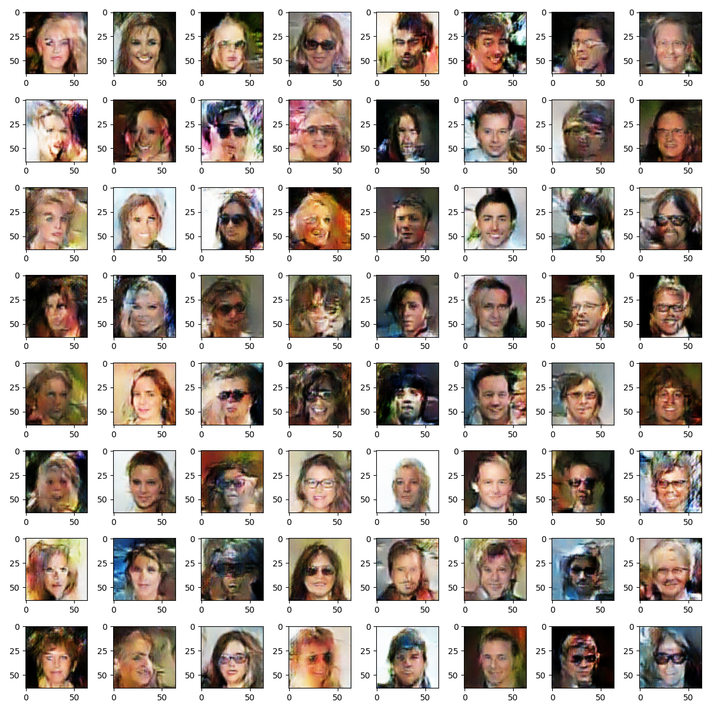
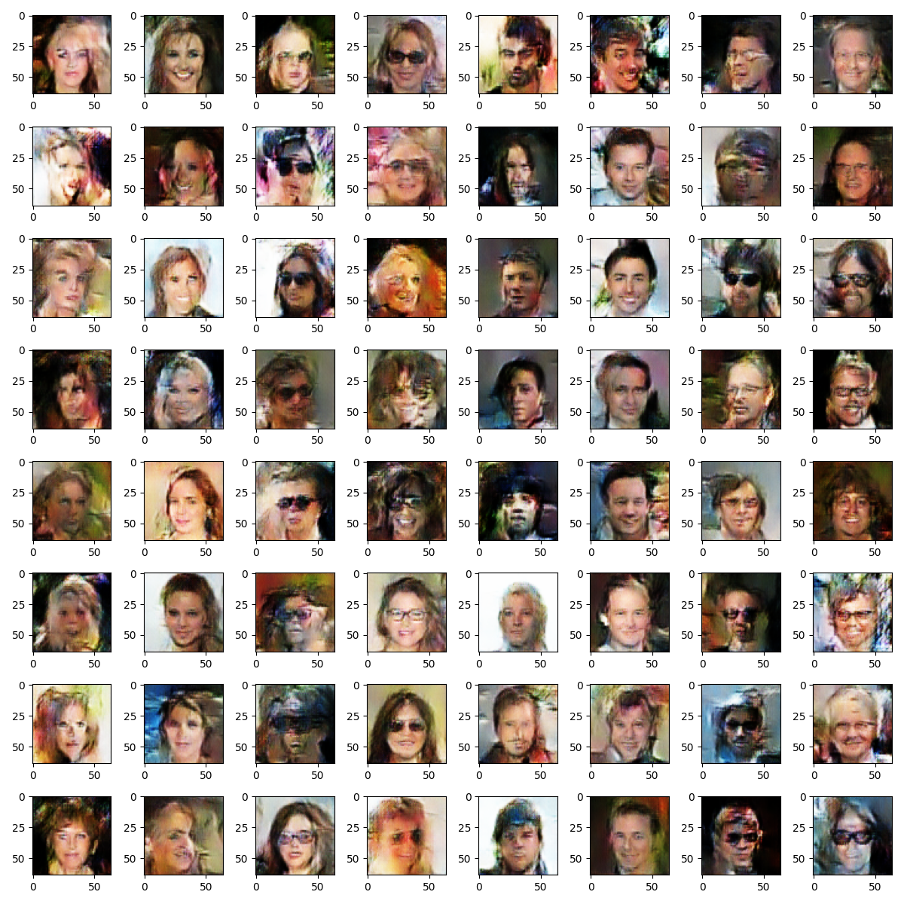
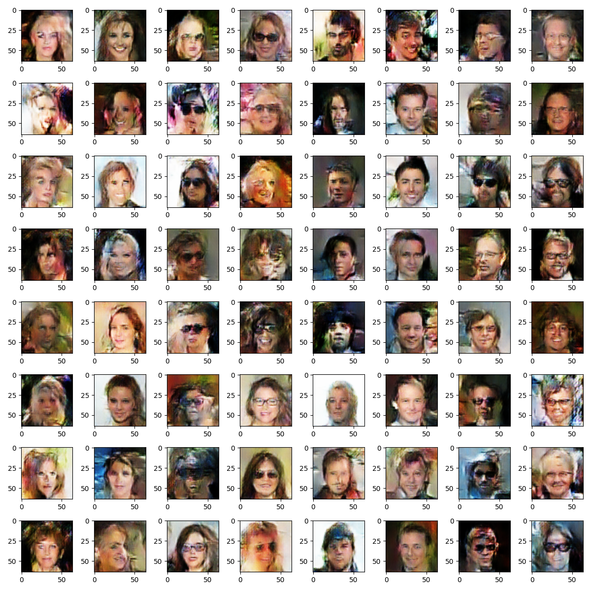
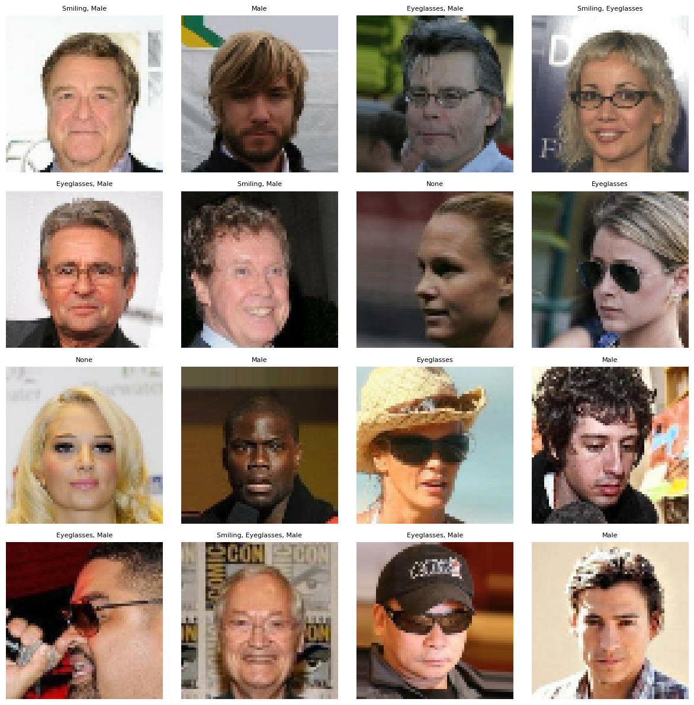
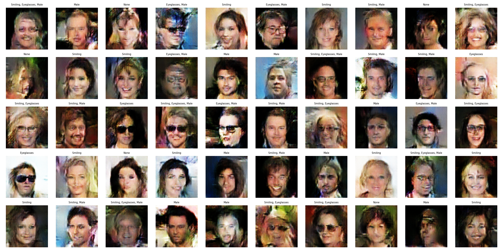
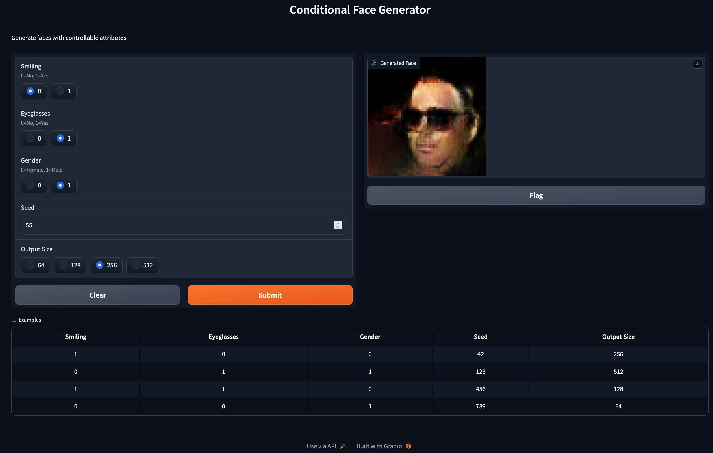
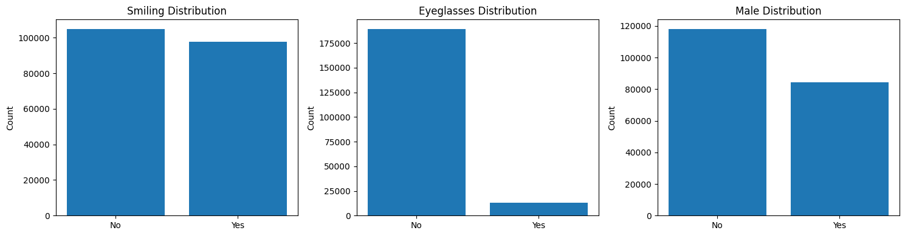
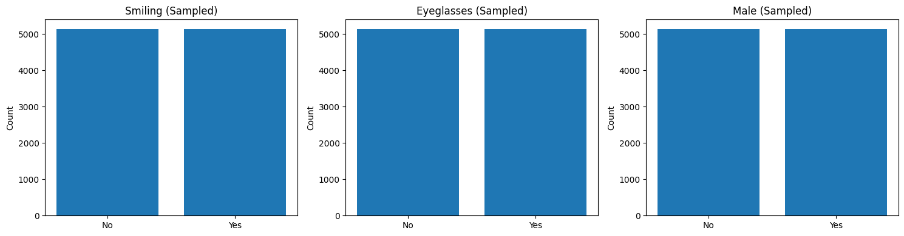
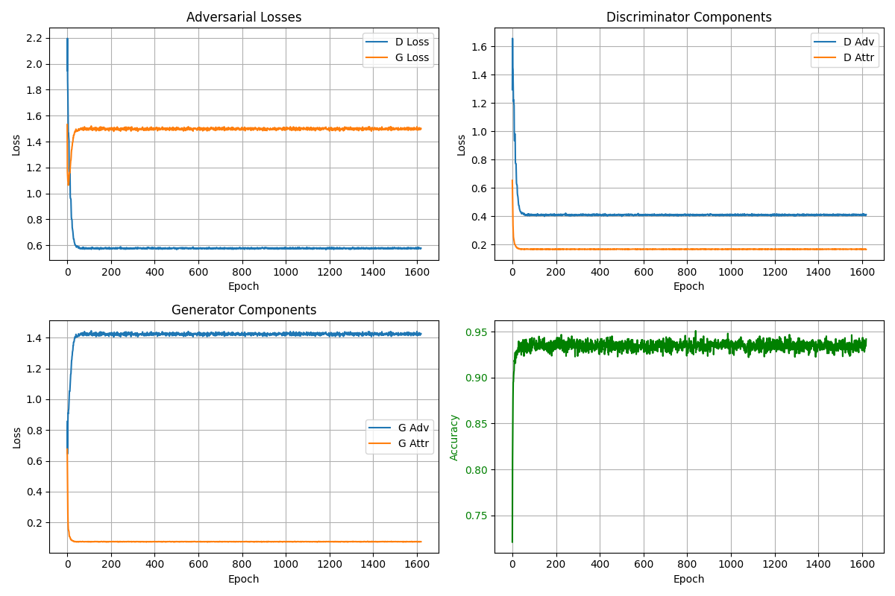
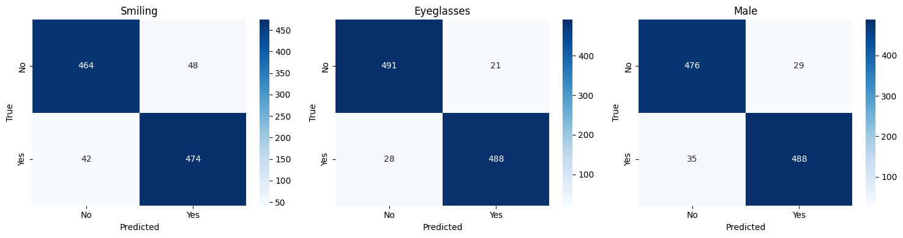

# Conditional Face Generation using cGAN

Generate photorealistic faces with controllable attributes (Smiling, Eyeglasses, Gender) using a Conditional Generative Adversarial Network trained on CelebA dataset.


---

## Table of Contents

- [Visual Overview](#visual-overview)
- [Project Description](#project-description)
- [Installation](#installation)
- [Quick Start](#quick-start)
- [Features](#features)
- [Dataset & Preprocessing](#dataset--preprocessing)
- [Model Architecture](#model-architecture)
- [Training Configuration](#training-configuration)
- [Results & Analysis](#results--analysis)
- [Repository Structure](#repository-structure)
- [Mathematical Foundations](#mathematical-foundations)
- [Technical Implementation](#technical-implementation)
- [Known Issues & Limitations](#known-issues--limitations)
- [Dependencies](#dependencies)
- [References](#references)
- [License](#license)
- [Acknowledgments](#acknowledgments)

---

## Visual Overview

### Training Progression (162 → 1620 Epochs)

<table>
<tr>
<td align="center"><br/><b>Epoch 162</b></td>
<td align="center"><br/><b>Epoch 324</b></td>
<td align="center"><br/><b>Epoch 486</b></td>
<td align="center"><br/><b>Epoch 648</b></td>
<td align="center"><br/><b>Epoch 810</b></td>
</tr>
<tr>
<td align="center"><br/><b>Epoch 972</b></td>
<td align="center"><br/><b>Epoch 1134</b></td>
<td align="center"><br/><b>Epoch 1296</b></td>
<td align="center"><br/><b>Epoch 1458</b></td>
<td align="center"><br/><b>Epoch 1620</b></td>
</tr>
</table>

### Final Results

| Dataset Samples | Generated Faces |
|:--:|:--:|
|  |  |

---

## Project Description

A Conditional Generative Adversarial Network (cGAN) implementation for generating 64×64 RGB face images with explicit control over three facial attributes: **Smiling**, **Eyeglasses**, and **Gender (Male)**. The model uses projection discriminator architecture with dual objectives: adversarial loss (real/fake classification) and attribute classification loss.

**Key Specifications:**
- **Architecture:** Generator (100D latent + 3D attributes → 64×64 RGB) + Dual-head Discriminator
- **Dataset:** CelebA with balanced sampling (10,280 images across 8 attribute combinations)
- **Training:** 1,620 epochs with mixed precision (FP16), 3:1 D/G training ratio
- **Performance:** 94.20% final validation attribute accuracy
- **Framework:** TensorFlow 2.16.2 with Keras API

---

## Installation

### Environment Setup

Create and activate conda environment:

```bash
conda create -n cgan-face python=3.11
conda activate cgan-face
```

Install dependencies:

```bash
pip install tensorflow==2.16.2 gradio==3.50.2 huggingface-hub==0.19.4 pillow==10.4.0 numpy==1.26.4
```

### Download Pre-trained Models

Download the trained models from [Kaggle](https://www.kaggle.com/models/chaching1998/rofevc/keras/version_1):
- `generator.keras` (44MB)
- `discriminator.keras`

Place them in the project root directory.

---

## Quick Start

### Running the Gradio Interface

```bash
python gradio_app.py
```

The app launches at `http://localhost:7860` with controls for:
- **Smiling:** 0 (No) / 1 (Yes)
- **Eyeglasses:** 0 (No) / 1 (Yes)
- **Gender:** 0 (Female) / 1 (Male)
- **Random seed** for reproducibility
- **Output size:** 64, 128, 256, or 512 pixels



### Programmatic Usage

Load the generator model and generate faces with specified attributes. The model accepts a 100-dimensional latent vector and a 3-dimensional attribute vector [smiling, eyeglasses, male], each with binary values (0 or 1).

---

## Features

- **Conditional Generation:** Explicit control over 3 binary facial attributes
- **Balanced Training:** Stratified sampling ensures equal representation of all 8 attribute combinations
- **Dual-Objective Discriminator:** Simultaneously performs adversarial and attribute classification
- **Mixed Precision Training:** FP16 acceleration for faster convergence on P100 GPU
- **Interactive Interface:** Real-time generation via Gradio web app
- **Reproducible Results:** Seed-controlled generation for consistent outputs

---

## Dataset & Preprocessing

### CelebA Dataset

**Source:** [CelebA Dataset on Kaggle](https://www.kaggle.com/datasets/jessicali9530/celeba-dataset)

The dataset contains 202,599 celebrity face images with 40 binary attribute annotations. For this project, we focus on 3 attributes while the full set includes:

<details>
<summary><b>All 40 CelebA Attributes (Click to expand)</b></summary>

`5_o_Clock_Shadow`, `Arched_Eyebrows`, `Attractive`, `Bags_Under_Eyes`, `Bald`, `Bangs`, `Big_Lips`, `Big_Nose`, `Black_Hair`, `Blond_Hair`, `Blurry`, `Brown_Hair`, `Bushy_Eyebrows`, `Chubby`, `Double_Chin`, `Eyeglasses`, `Goatee`, `Gray_Hair`, `Heavy_Makeup`, `High_Cheekbones`, `Male`, `Mouth_Slightly_Open`, `Mustache`, `Narrow_Eyes`, `No_Beard`, `Oval_Face`, `Pale_Skin`, `Pointy_Nose`, `Receding_Hairline`, `Rosy_Cheeks`, `Sideburns`, `Smiling`, `Straight_Hair`, `Wavy_Hair`, `Wearing_Earrings`, `Wearing_Hat`, `Wearing_Lipstick`, `Wearing_Necklace`, `Wearing_Necktie`, `Young`
</details>

### Selected Attributes Distribution (Original Dataset)

| Attribute | No (0) | Yes (1) | Imbalance Ratio |
|-----------|--------|---------|-----------------|
| **Smiling** | 104,930 | 97,669 | 1.07:1 |
| **Eyeglasses** | 189,406 | 13,193 | **14.4:1** |
| **Male** | 118,165 | 84,434 | 1.40:1 |



### Balanced Sampling Strategy

To mitigate severe class imbalance (especially for Eyeglasses), we employ stratified sampling across all 8 possible attribute combinations. Each combination is sampled equally with 1,285 images per bucket, resulting in a total of 10,280 training images.

| Combination | Description | Original Count | Sampled |
|-------------|-------------|----------------|---------|
| (1, 0, 0) | Smiling, No Glasses, Female | 62,586 | 1,285 |
| (0, 0, 0) | Not Smiling, No Glasses, Female | 52,864 | 1,285 |
| (0, 0, 1) | Not Smiling, No Glasses, Male | 44,175 | 1,285 |
| (1, 0, 1) | Smiling, No Glasses, Male | 29,781 | 1,285 |
| (0, 1, 1) | Not Smiling, Glasses, Male | 6,461 | 1,285 |
| (1, 1, 1) | Smiling, Glasses, Male | 4,017 | 1,285 |
| (0, 1, 0) | Not Smiling, Glasses, Female | 1,430 | 1,285 |
| (1, 1, 0) | Smiling, Glasses, Female | 1,285 | 1,285 |
| **Total** | | **202,599** | **10,280** |



### Preprocessing Pipeline

1. **Center Crop:** Crop to minimum dimension (square)
2. **Resize:** 64×64 pixels
3. **Normalization:** Pixel values scaled to [-1, 1]
4. **Format:** RGB, float32
5. **Split:** 90% train (9,252 images) / 10% validation (1,028 images)


---

## Model Architecture

### Generator

**Input:** 100D latent vector $\mathbf{z} \sim \mathcal{N}(0, 1)$ + 3D attribute vector $\mathbf{a} \in \{0, 1\}^3$

**Architecture Flow:**
- Concatenate latent and attribute vectors (103D)
- Dense layer to 4×4×256, reshape
- 4 transposed convolution blocks with progressive upsampling
- Final output: 64×64×3 RGB image via Tanh activation

**Output Resolution Progression:** 4×4 → 8×8 → 16×16 → 32×32 → 64×64

**Total Parameters:** ~7.5M

### Discriminator (Dual-Head)

**Input:** 64×64×3 RGB image + 3D attribute vector

**Architecture Components:**
- **Shared Feature Extraction:** 4 convolutional layers with progressive downsampling
- **Head 1 (Attribute Classifier):** Dense layer with sigmoid activation for 3 binary attributes
- **Head 2 (Real/Fake with Projection):** Conditional projection combining image features with attribute embedding

**Output Resolution Progression:** 64×64 → 32×32 → 16×16 → 8×8 → 4×4 → flatten

**Total Parameters:** ~2.8M

---

## Training Configuration

### Hyperparameters

| Parameter | Value |
|-----------|-------|
| **Latent Dimension** | 100 |
| **Batch Size** | 64 |
| **Epochs** | 1,620 |
| **Learning Rate** | 1e-3 (initial) |
| **Optimizer** | Adam (β₁=0.0, β₂=0.999) |
| **D/G Training Ratio** | 3:1 |
| **Mixed Precision** | FP16 |
| **Early Stopping Patience** | 1,620 epochs (disabled) |
| **LR Decay Patience** | 162 epochs |
| **LR Decay Factor** | 0.5 |

### Loss Functions

**Discriminator Loss:**

$$\mathcal{L}_D = \mathcal{L}_D^{\text{adv}} + \mathcal{L}_D^{\text{attr}}$$

- **Hinge Loss (Adversarial):**
  $$\mathcal{L}_D^{\text{adv}} = \mathbb{E}_{\mathbf{x} \sim p_{\text{data}}}[\max(0, 1 - D(\mathbf{x}, \mathbf{a}))] + \mathbb{E}_{\mathbf{z} \sim p_z}[\max(0, 1 + D(G(\mathbf{z}, \mathbf{a}), \mathbf{a}))]$$

- **Attribute Loss (Binary Cross-Entropy):**
  $$\mathcal{L}_D^{\text{attr}} = -\sum_{i=1}^{3} [a_i \log(\hat{a}_i) + (1 - a_i) \log(1 - \hat{a}_i)]$$

**Generator Loss:**

$$\mathcal{L}_G = \mathcal{L}_G^{\text{adv}} + \mathcal{L}_G^{\text{attr}}$$

- **Hinge Loss:**
  $$\mathcal{L}_G^{\text{adv}} = -\mathbb{E}_{\mathbf{z} \sim p_z}[D(G(\mathbf{z}, \mathbf{a}), \mathbf{a})]$$

- **Attribute Loss:** Same as discriminator

---

## Results & Analysis

### Final Training Metrics (Epoch 1620)

| Metric | Value |
|--------|-------|
| **Discriminator Loss** | 0.5774 |
| **Generator Loss** | 1.4995 |
| **Validation Attribute Accuracy** | **94.20%** |
| **Training Duration** | 1,620 epochs |

### Training Curves



**Observations:**
- Stable convergence with minimal mode collapse
- Discriminator maintains slight advantage (desired for GAN stability)
- Attribute classification accuracy plateaus at ~93-94% after epoch 800
- Gradual learning rate decay prevents oscillations

### Attribute Classification Performance

**Overall Validation Accuracy:** 93.51%

#### Confusion Matrices



#### Per-Attribute Metrics

**Smiling:**
| Class | Precision | Recall | F1-Score | Support |
|-------|-----------|--------|----------|---------|
| No | 0.917 | 0.906 | 0.912 | 512 |
| Yes | 0.908 | 0.919 | 0.913 | 516 |
| **Accuracy** | | | **0.9125** | 1,028 |

**Eyeglasses:**
| Class | Precision | Recall | F1-Score | Support |
|-------|-----------|--------|----------|---------|
| No | 0.946 | 0.959 | 0.953 | 512 |
| Yes | 0.959 | 0.946 | 0.952 | 516 |
| **Accuracy** | | | **0.9523** | 1,028 |

**Male:**
| Class | Precision | Recall | F1-Score | Support |
|-------|-----------|--------|----------|---------|
| No | 0.932 | 0.943 | 0.937 | 505 |
| Yes | 0.944 | 0.933 | 0.939 | 523 |
| **Accuracy** | | | **0.9377** | 1,028 |

**Key Insights:**
- Eyeglasses achieves highest accuracy (95.23%) despite severe original imbalance (14.4:1 ratio)
- Balanced sampling strategy successfully mitigates class imbalance
- All attributes show F1-scores > 0.91, indicating robust classification
- Precision and recall are well-balanced across all classes

### Generated Samples


**Quality Assessment:**
- Sharp 64×64 resolution with realistic skin tones
- Accurate attribute manifestation (eyeglasses, smiles, gender features)
- Minimal artifacts or mode collapse
- Diverse facial structures and lighting conditions

---

## Repository Structure

```
conditional-face-cgan/
├── code.ipynb                    # executed training notebook (44MB)
├── gradio_app.py                 # interactive web interface
├── generator.keras               # trained generator model
├── discriminator.keras           # trained discriminator model
├── training_metrics.csv          # per-epoch loss/accuracy logs
├── images/
│   ├── app_demo.png
│   ├── original_dataset_images.png
│   ├── 64x64_selected_attributes_images.png
│   ├── original_distribution.png
│   ├── selected_distribution.png
│   ├── losses.png
│   ├── confusion_matrices.png
│   ├── samples_epoch_162.png
│   ├── samples_epoch_324.png
│   ├── samples_epoch_486.png
│   ├── samples_epoch_648.png
│   ├── samples_epoch_810.png
│   ├── samples_epoch_972.png
│   ├── samples_epoch_1134.png
│   ├── samples_epoch_1296.png
│   ├── samples_epoch_1458.png
│   ├── samples_epoch_1620.png
│   └── final_samples.png
├── README.md
└── LICENSE
```

---

## Mathematical Foundations

### Conditional GAN Objective

The minimax game between generator $G$ and discriminator $D$ with conditioning on attributes $\mathbf{a}$:

$$\min_G \max_D \mathbb{E}_{\mathbf{x} \sim p_{\text{data}}}[\log D(\mathbf{x} | \mathbf{a})] + \mathbb{E}_{\mathbf{z} \sim p_z}[\log(1 - D(G(\mathbf{z} | \mathbf{a}) | \mathbf{a}))]$$

### Projection Discriminator

Instead of naive concatenation, we use conditional projection to incorporate attributes:

$$D(\mathbf{x}, \mathbf{a}) = \phi(\mathbf{x})^\top \psi(\mathbf{a}) + \xi(\mathbf{x})$$

Where:
- $\phi(\mathbf{x})$: Image feature extractor
- $\psi(\mathbf{a})$: Attribute embedding
- $\xi(\mathbf{x})$: Unconditional real/fake score

This formulation improves gradient flow and attribute disentanglement compared to simple concatenation approaches.

### Hinge Loss Formulation

More stable than vanilla GAN loss for high-resolution generation:

$$\mathcal{L}_D^{\text{hinge}} = \mathbb{E}_{\mathbf{x}}[\max(0, 1 - D(\mathbf{x}, \mathbf{a}))] + \mathbb{E}_{\mathbf{z}}[\max(0, 1 + D(G(\mathbf{z}, \mathbf{a}), \mathbf{a}))]$$

$$\mathcal{L}_G^{\text{hinge}} = -\mathbb{E}_{\mathbf{z}}[D(G(\mathbf{z}, \mathbf{a}), \mathbf{a})]$$

The hinge loss provides a margin of safety, reducing oscillations and improving training stability.

---

## Technical Implementation

### Mixed Precision Training

Enabled via TensorFlow's `mixed_float16` policy for 1.5-2× speedup on P100 GPU. Critical adaptations include loss scale optimizer wrapping to prevent gradient underflow, explicit float32 casting for final activation layers, and output clipping after denormalization.

### Balanced Sampling Algorithm

Stratified sampling is performed across all 8 attribute combinations with a target of 1,285 images per bucket. For each combination, we sample the minimum of the target size or available samples, ensuring equal representation even for rare combinations like "Smiling + Glasses + Female" (originally only 1,285 samples).

### 3:1 Discriminator Training Ratio

For each generator update, the discriminator trains 3 times. This ratio prevents the generator from overwhelming the discriminator early in training and maintains a healthy adversarial balance throughout the training process.

### Learning Rate Scheduling

Learning rate decays by 50% when validation accuracy shows no improvement for 162 consecutive epochs. This adaptive scheduling prevents oscillations in later training stages while allowing aggressive learning in early epochs.

---

## Known Issues & Limitations

### 1. Resolution Constraint (64×64)
Architecture designed specifically for 64×64 output. Higher resolutions require progressive growing or additional upsampling layers. The Gradio interface upsamples via nearest-neighbor interpolation without learned upsampling.

### 2. Attribute Correlation Artifacts
Despite balanced sampling, the model occasionally generates correlated artifacts:
- Male faces with eyeglasses tend toward older appearances
- Female faces without eyeglasses show higher makeup correlation
- Root cause: Residual correlations in CelebA dataset (82% of eyeglasses samples are male in original dataset)

### 3. Mode Collapse for Rare Combinations
Training curves show occasional spikes in generator loss during epochs 1-50, indicating temporary mode collapse for rare attribute combinations. This is mitigated through extended training (1,620 epochs), balanced sampling strategy, and 3:1 D/G training ratio.

### 4. Discriminator Accuracy Plateau
Validation attribute accuracy plateaus at ~94% despite continued training. This represents a likely ceiling due to label noise in CelebA annotations, as some images have genuinely ambiguous attributes (subtle smiles, tinted glasses).

### 5. Limited Attribute Diversity
Only 3 of 40 CelebA attributes are controllable. Expanding to more attributes requires:
- Larger latent space (100D may bottleneck with >5 attributes)
- Increased model capacity
- Careful attribute selection to avoid contradictions (e.g., "Bald" vs. "Bangs")

### 6. Inference Speed
Generator inference takes approximately 6-8ms per image on GPU. The Gradio interface incurs additional latency from image encoding/decoding. Batch processing is recommended for high-throughput applications.

### 7. Training Instability (Early Epochs)
First 100 epochs show volatile loss oscillations (visible in training curves). Training stabilizes after discriminator establishes baseline accuracy. Future implementations could benefit from spectral normalization or R1 regularization for smoother convergence.

### 8. No Interpolation Controls
Current interface uses discrete 0/1 attribute values. Continuous interpolation (e.g., 0.5 for "slightly smiling") is theoretically possible but not implemented in the current version.

---

## Dependencies

### Core Requirements

```
tensorflow==2.16.2
numpy==1.26.4
pillow==10.4.0
gradio==3.50.2
huggingface-hub==0.19.4
```

### Training Environment (Optional)

```
pandas>=1.3.0
matplotlib>=3.5.0
seaborn>=0.11.0
scikit-learn>=1.0.0
```

### Hardware Requirements

- **GPU:** NVIDIA P100 (16GB VRAM) or equivalent
- **RAM:** 16GB minimum
- **Storage:** 50GB (dataset + checkpoints + training logs)

---

## References

1. Goodfellow, I., et al. (2014). "Generative Adversarial Networks." *NeurIPS*.
2. Mirza, M., & Osindero, S. (2014). "Conditional Generative Adversarial Nets." *arXiv:1411.1784*.
3. Miyato, T., & Koyama, M. (2018). "cGANs with Projection Discriminator." *ICLR*.
4. Liu, Z., et al. (2015). "Deep Learning Face Attributes in the Wild." *ICCV* (CelebA Dataset).
5. Lim, J. H., & Ye, J. C. (2017). "Geometric GAN." *arXiv:1705.02894* (Hinge Loss Formulation).

---

## License

This project is licensed under the MIT License. See [LICENSE](LICENSE) file for details.

---

## Acknowledgments

- **Kaggle** for providing P100 GPU compute resources
- **CelebA Dataset** creators (MMLAB, Chinese University of Hong Kong)
- **TensorFlow/Keras** team for deep learning framework
- **Gradio** team for rapid prototyping interface

---

**For questions or collaborations, open an issue in this repository.**